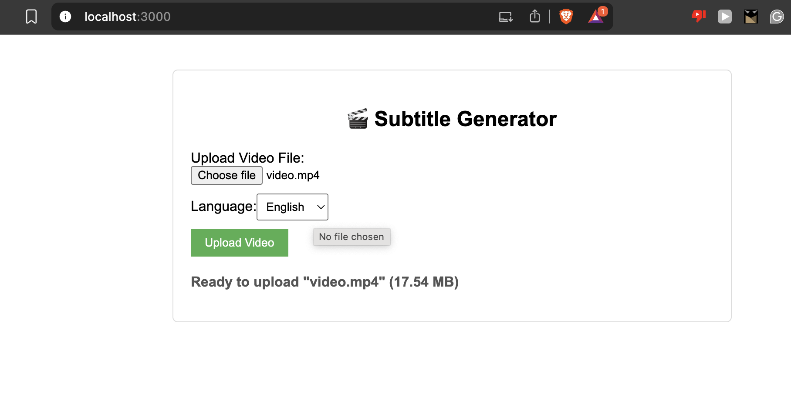

# 🎬 Video Subtitle Generator

This project is a web-based application that automatically generates subtitles for video files. It uses a React frontend, a Spring Boot backend, and OpenAI's Whisper model for transcription.



## ✨ Features

*   **Asynchronous subtitle generation:** Upload a video and get a transaction ID to check the status later.
*   **Support for multiple languages:** Select the language of the video to improve transcription accuracy.
*   **Automatic SRT file download:** The generated subtitle file is automatically downloaded once the processing is complete.
*   **RESTful API:** A simple and easy-to-use API for subtitle generation.

## 🛠️ Technologies Used

*   **Frontend:** React, TypeScript, Axios, Framer Motion
*   **Backend:** Spring Boot, Java 21, Maven
*   **Transcription:** OpenAI Whisper
*   **API Documentation:** OpenAPI, Swagger

## 📋 Prerequisites

Before you begin, ensure you have the following installed:

*   [Java Development Kit (JDK) 21](https://www.oracle.com/java/technologies/javase-jdk21-downloads.html)
*   [Apache Maven](https://maven.apache.org/download.cgi)
*   [Node.js and npm](https://nodejs.org/en/download/)
*   [Python 3](https://www.python.org/downloads/)
*   [Whisper](https://github.com/openai/whisper)

## 🚀 Getting Started

To run the application locally, follow these steps:

### 1. Backend

Navigate to the `backend` directory and run the following command to start the Spring Boot application:

```bash
./mvnw spring-boot:run
```

The backend server will start on `http://localhost:8080`.

### 2. Frontend

Navigate to the `frontend` directory and install the dependencies:

```bash
npm install
```

Then, run the following command to start the React development server:

```bash
npm start
```

The frontend application will be accessible at `http://localhost:3000`.

## 📂 Project Structure

The project is organized into two main directories:

*   `backend`: Contains the Spring Boot application that handles video uploads, subtitle generation, and serving the API.
*   `frontend`: Contains the React application that provides the user interface for uploading videos and downloading subtitles.

##  API

The application exposes a three-step asynchronous API for subtitle generation:

1.  **`POST /v1/api/upload`**: Submit a video file for subtitle generation. This endpoint accepts a multipart form data request with two fields: `file` (the video file) and `language` (the language of the video). It returns a transaction ID that can be used to check the status of the job.

2.  **`GET /v1/api/status/{txId}`**: Check the status of a subtitle generation job. Replace `{txId}` with the transaction ID obtained from the upload step. The possible statuses are `PROCESSING`, `COMPLETED`, and `ERROR`.

3.  **`GET /v1/api/result/{txId}`**: Download the generated subtitle file. Replace `{txId}` with the transaction ID. This endpoint returns the subtitle file in SRT format.

For more detailed information about the API, you can refer to the [OpenAPI Specification](doc/openapispec.yaml) or visit the Swagger UI at `http://localhost:8080/swagger-ui.html`.
